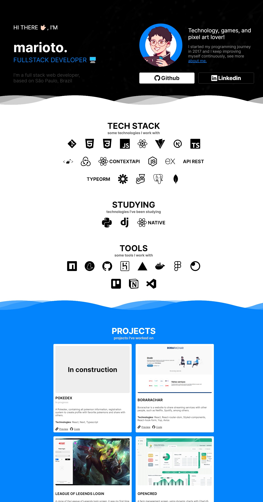
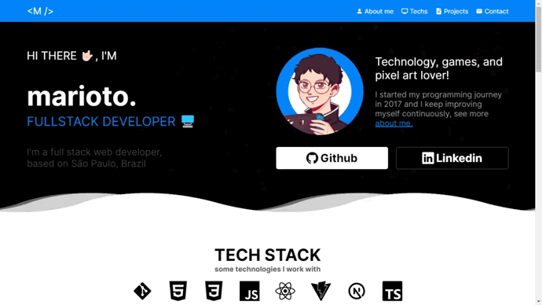

# Meu portfólio

This is my portfolio website, here you will find some links to communicate with me, see my projects and technologies that I use

Preview link: https://portfolio-marioto-nextjs.vercel.app/

Figma link: https://www.figma.com/file/MPNyQmnxEGh3FzlCL8SUpo/Portfolio-Paulo-Marioto?node-id=0%3A1

## 🎬 Prints

  
  

## ⚙️Technologies
- [React](https://reactjs.org/)
- [Nextjs](https://nextjs.org/)
- [Typescript](https://www.typescriptlang.org/)
- [Styled-components](https://styled-components.com/)
- [React-icons](https://react-icons.github.io/react-icons/)
- [AOS](https://michalsnik.github.io/aos/)
- [React-hook-form](https://react-hook-form.com/)
- [Yup](https://www.npmjs.com/package/yup)
- [EmailJS](https://www.emailjs.com/)
